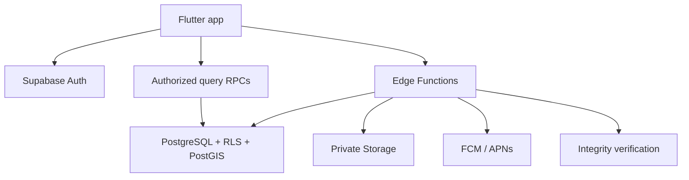
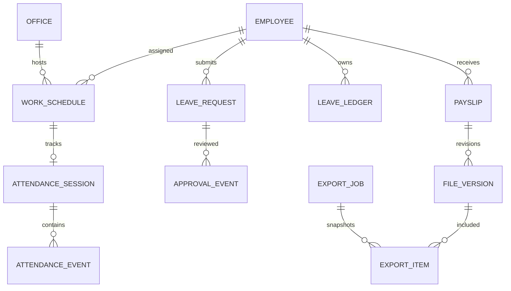
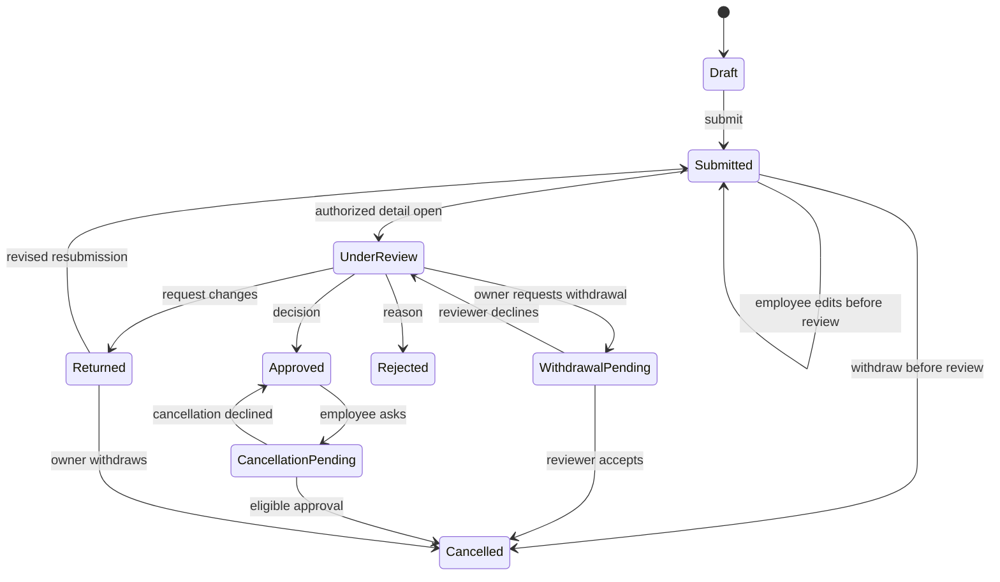

# Internal HRMS — architecture

Specification version: 1.1 · 29 September 2026 · Status: implementation specification, not implemented software.

Read with [agent.md](agent.md), [design.md](design.md), [test.md](test.md), and [continue.md](continue.md). Screenshots in `docs/ui-reference/` are visual references, not sources of employee or company data.

## 1. Product contract and scope

One Flutter application for Android and iOS; all Member, Manager, HR, and Admin functions are mobile screens. One organization, approximately 20 active employees, multiple departments, teams, offices, and effective-dated shifts. Every person, including Admin, is an employee for attendance and leave purposes. No desktop portal or web implementation is required.

Confirmed features: Employee ID/password login provisioned by Admin or authorized HR; location-verified IN/OUT; attendance regularization; configurable approvers; editable requests until an authorized reviewer opens them; leave allocation/balances; 12 initially planned company holidays with Admin additions; shifts, paid lunch, grace and work-hour reports; detailed profiles; uploaded payslip PDFs; 5 MB files; latest 12 salary-month employee view; Excel and employee-folder ZIP exports; annual export task and gated file cleanup; private documents; notifications; audit history.

Scope boundaries: no salary calculation, tax filing, statutory payroll engine, biometrics/eSSL device, continuous tracking, background GPS, SMS OTP, web portal, separate Node backend, Redis, or real employee data seeded from screenshots. YTD/tax screens, social feed, Helpdesk, Worklife, likes/comments, and break punches remain deferred. Company announcement notifications may be sent by HR/Admin; this does not require an Engage social feed.

### 1.1 Decision register

Values called defaults below are implementation choices, not unprovided company facts. Admin onboarding reviews and publishes them before live use.

| ID | Decision / default | Behavior |
| --- | --- | --- |
| D01 | Flutter mobile only | Native tests replace browser UI testing |
| D02 | Supabase Auth, PostgreSQL/PostGIS, private Storage; FCM | Minimal services; Tigris/Brevo not required |
| D03 | Organization time zone Asia/Kolkata | UTC storage; date grouping uses office time zone; no device-time authority |
| D04 | Annual export period configurable | Jan–Dec initial draft; April–March also supported; choose during setup; changes prospective only |
| D05 | Employee payslip window | Current salary month plus previous 11 calendar months, based on period, not upload date; archived files display metadata/contact-HR instead of dead links |
| D06 | Maximum individual file | Exactly 5,000,000 bytes inclusive (decimal 5 MB); 0 bytes invalid |
| D07 | Shift initial draft | 10:00–19:00; 9 hours including paid lunch; 30-minute arrival grace |
| D08 | Extended checkout initial draft | Enabled, up to 120 minutes after shift end; configurable; no automatic credit for early arrival |
| D09 | Lunch | Admin sets interval, initially unconfigured; included/paid by default; no punch required; cannot exceed shift |
| D10 | Office geofence draft | Radius 20 m, reported horizontal accuracy <=15 m, location age <=10 s; configurable after physical-site tests |
| D11 | Approval | Admin selects Manager or HR per team/request kind, with explicit eligible fallback; no self-approval |
| D12 | Holidays vs leave | Target 12 company holidays is editable, not legal advice or a national list; paid-leave entitlement is separate and must be configured |
| D13 | Annual cleanup | Admin only, manual after archive verification + local save acknowledgment; files only; never an automatic database wipe |
| D14 | No email login requirement | Internal auth aliases; in-app/admin password reset; no email OTP or default-SMTP dependency |
| D15 | One attendance session per scheduled shift | Break events reserved but disabled; missed punches use correction workflow |
| D16 | Active employee cap | Initial configured cap 20; Admin may change after capacity/cost review; activation/provisioning enforces cap transactionally |

## 2. Architecture and trust boundaries



Flutter: feature-first presentation/application/domain/data separation, Riverpod for asynchronous state and in-memory query caching, go_router for guarded routes, Supabase Flutter SDK, Firebase Messaging, secure platform key storage, compatible geolocation plugin, immutable DTO serialization. Select current stable compatible packages at implementation and commit lockfiles. Avoid an unnecessary second state framework; Redux is not added.

Use SQL RPCs for atomic operations and report queries; Edge Functions for Auth Admin operations, platform integrity verification, file lifecycle, and notifications. Never treat client-supplied roles, salary ownership, inside-zone booleans, approved flags, or client clocks as authoritative. Edge service credentials bypass RLS, so every service path must explicitly authorize the authenticated actor. No secret/service-role key in the app, logs, assets, or exported files.

Routine safe reads use security-invoker RPCs/views plus RLS. Sensitive reads that require a review lock or an access audit use a narrow, explicitly authorized server function. Full request reasons/revisions/attachments and HR-private details have no generic reviewer SELECT path; expose minimal queue/directory projections only. A detail-read RPC performs permission check, lock/audit and returning its exact authorized version in the same transaction. Realtime payloads, exports and alternate views must not become a route around these read controls. Critical mutations are narrow RPCs in transactions with row locks, constraints, expected versions and idempotency. Revoke direct table mutation for verified records, leave ledgers, workflow states, published files, audit, privileges, archive eligibility. Security-definer helpers have fixed empty/safe search paths, qualified objects, minimal EXECUTE grants and no caller-controlled actor ID. Restrict internal RPCs to service execution where needed.

## 3. Identity, roles and permissions

### 3.1 Provisioned ID/password login

- Login field is an immutable unique employee code such as `EMP001`; normalize by trim + uppercase with allowlist `[A-Z0-9-]`, length 3–32.
- Map code deterministically to an internal email-shaped Supabase identity under an organization-controlled namespace. It is an implementation identity, not an employee inbox. Do not expose a public lookup of private contact email.
- Turn off public signup and anonymous login. Expose no email-based recovery in the app; account resets use authorized server functions. Internal aliases have no staff inbox and must not accidentally receive deliverable reset links. Keep secure email-change verification enabled. Do not assume hiding an Auth feature disables its provider endpoint: test direct Auth update/recovery/metadata calls. App roles, employee code, credential gates and reauthentication grants are server-owned, never user_metadata. An unexpected Auth alias change cannot relink an employee or grant access; flag it for Admin repair against the immutable auth UUID. Native Auth password policy applies even to direct calls, and a direct password update cannot clear the first-change gate or issue a sensitive-action grant.
- Provisioning saga: create pending employee record, create Auth identity, link immutable auth UUID, mark setup complete. Retry by operation ID; reconcile failures without orphaned privileges or duplicates.
- HR can provision Member/Manager records only within granted scope; cannot appoint Admin, grant self payroll/export privileges, change sole Admin or reset another Admin. Admin manages HR/Admin permissions.
- Generate a random temporary password, display it once to the authorized issuer; never store plaintext in application tables or audit. Login grants a restricted session requiring password change. Every business RPC/RLS gate checks account active, completed provisioning, `must_change_password=false`, no credential-operation hold, and an existing non-revoked Auth session whose **original session creation time** is at or after `credentials_valid_after`. A narrow server-owned helper checks the JWT `session_id` against Auth session state; do not expose the Auth schema to clients. Refreshed JWT `iat` alone is insufficient because an old refresh token could otherwise regain access.
- The application password change/reset is a fail-closed saga: authorize actor and, for self-change, verify current password; acquire an employee credential-operation lock; set a business-access hold and operation ID before calling Auth. Update Auth, then commit the credentials-valid-after barrier and required-first-change state, and clear the hold last. Never hold a SQL transaction open across Auth HTTP. If Auth or finalization fails, keep the hold and expose only restricted recovery/status operations. Reconcile by verifying the intended current credential through Auth, never by blindly clearing the hold. Admin reset always leaves must_change_password=true; successful self-change leaves it false. After reset/change set credentials-valid-after and require a fresh login. Use supported Auth session-revocation APIs as well as the business-session gate; do not directly mutate internal Auth tables. Test old access and refresh tokens, including freshly refreshed JWTs from a pre-reset session; never rely only on client route guards.
- Minimum 12 characters, allow paste/password managers; generic login/reset failure, IP + account rate limits with bounded temporary cooldowns. No permanent lock from attacker-triggered failures. Passwords are hashed by Auth, not a custom password table.
- Authorized HR/Admin can reset an eligible employee; existing business sessions fail closed on credentials-valid-after. Reauthenticate within 5 minutes for role elevation, annual cleanup and bulk salary export. A server endpoint verifies the current password through Auth and issues a short-lived, actor/session/action-bound reauthentication grant. Sensitive writes check this stored grant; a client timestamp or recently refreshed JWT is not proof of reauthentication. Consume one-time cleanup grants when a job begins; resumed jobs remain limited to their approved inventory and require a new grant after expiry. No OTP dependency.
- Protect last active Admin. The bootstrap owner is created by a documented server/operator step and must change credentials. No shared accounts.

### 3.2 Permissions and visibility

| Capability | Member | Manager | HR | Admin |
| --- | --- | --- | --- | --- |
| Own punches/leave/profile/payslips | Yes | Yes | Yes | Yes |
| Coworker directory | Safe fields | Safe fields | HR fields | HR fields |
| Attendance reports | Own | Managed teams | Organization | Organization |
| Request details / decisions | Own request | Only assigned eligible queue | Assigned eligible queue | Eligible fallback/override with reason |
| HR master-data maintenance | No | No | Granted HR scope | All |
| Set approval route | No | No | No | Yes |
| Holiday/shift/leave-policy publishing | Read | Read | Draft/manage delegated fields | Publish/configure |
| Upload/publish payslips | No | No | Explicit `payroll_manage` grant | Yes |
| Read other salary/documents | No | No | Payroll/HR grant by document class | Yes |
| Annual export/cleanup | No | No | No | Yes |
| Security/roles/full audit | No | No | Scoped audit | Yes |

Foreign keys on employee/audit/business history use RESTRICT or soft deactivation, not cascaded hard deletion. Only disposable staging objects have narrowly bounded orphan cleanup.

Roles are bundles of server-side permissions. HR is a role, not a team; there can be more than one HR account and many teams. One primary team/manager at a time per employee; a manager can manage several teams. Effective-date team/manager changes. Archived employee records remain reportable; inactive users cannot log into business data, punch or approve. Tenant/org checks remain mandatory even in single-organization deployment.

Manager report scope uses team membership on each record's work date AND current permission to manage that team. A team transfer does not reveal earlier other-team records to the new manager. A retained approval assignment grants access to that one request, not the employee's complete history. HR/Admin scope remains as defined above.

Safe directory: name, avatar, employee code, designation, department, team and approved business contact. Private HR data: personal contacts, address, emergency contact, employment dates/status; bank/tax ID is not required for uploaded payslips and should not be collected by default. Payroll and medical leave attachments are separate permissions. A manager sees dates/type/status needed to decide; medical attachments only when explicitly necessary and granted. Employee role labels cannot confer permissions.

## 4. Data model and invariants

Use UUID PKs, FK constraints, `org_id`, UTC `created_at`/`updated_at`, actor IDs and optimistic `version` where mutable. Sensitive SQL tables are not broadly exposed. Effective ranges use inclusive start/exclusive end; no overlapping current assignments. DB money, if extracted/displayed manually, is integer paise; no payroll calculation.

| Entity | Core fields / constraints |
| --- | --- |
| organizations / settings_versions | timezone, annual_start_month {1,4}, current_version, activation date; immutable history |
| employees | auth_user_id unique, employee_code unique per org, name, designation, department, join/end date, status, credential gate/operation hold |
| credential_operations | employee, authorized issuer, operation_id unique, stage, barrier timestamp, expiry/recovery status; no plaintext secret |
| employee_private_details | employee_id unique, personal/emergency contact, address; separate RLS |
| roles / employee_role_grants | role, permission, effective range, issuer; Admin-only writes |
| departments / teams / team_assignments | team, manager, employee, effective dates; no assignment cycles or cross-org references |
| offices | name, geography(Point,4326), active, timezone; versioned coordinates/geofence config |
| office_assignments | employee, office, validity; explicit authorized offices |
| shift_versions / shift_assignments | local start/end, crosses_midnight flag, weekly mask, grace, lunch interval, checkout extension, validity |
| work_schedule_instances | employee, office, shift_date, start/end UTC, policy/holiday snapshots, expected seconds; unique employee/shift instance |
| devices | employee, installation/key ID, platform, attestation key/counter, revoked_at; no IMEI requirement |
| reauthentication_grants | actor, session_id, allowed action/target, issued_at, expires_at, consumed_at; server-only creation |
| punch_challenges / idempotency_records | actor/device/action/payload hash, expiry, consumed result; unique actor+operation key |
| attendance_sessions | schedule instance unique, open/closed/needs_correction, effective durations, effective revision |
| attendance_events | append-only accepted events; server timestamp, coordinate evidence, accuracy, device/integrity and policy snapshot |
| correction_requests / correction_revisions | target shift/session, proposed interval, reason, version, state, review lock, assigned approver |
| leave_policies / leave_types | effective dates, annual allowance, carry cap, accrual/prorata settings, approval rules; versioned |
| leave_accounts / leave_allocations / leave_reservations / leave_ledger | account per employee/type/year; allocation source/expiry/carry cap; reservations by request revision/day/allocation; ledger delta links exact allocation and transition operation; no double debit/credit |
| leave_requests / leave_request_days / leave_revisions | date range, half-day slot, units, reason, state, versions, assigned reviewer, policy snapshot |
| approval_assignments / approval_events | typed request FK, eligible reviewer, route snapshot, first_opened_at, version, action, actor; no orphan polymorphic IDs |
| holidays | local date, office scope, name, published, source, version; unique active office/date or explicit combined label |
| file_records / file_versions | owner, class, period_start/end or document_date, object_key, MIME, size, trusted sha256, state, supersedes |
| payslips | employee, salary_month first-of-month, current_published_file_version; one current publication per employee/month |
| notifications / push_tokens / outbox | recipient, minimal payload, delivery attempt, dedupe key, status; token per user/device |
| export_jobs / export_rows / export_items | period, cutoff, manifest version/hash, source versions, frozen rows, actor, counts, status |
| cleanup_jobs / cleanup_items | export manifest, immutable target file-version IDs, per-object state, worker lease, lifecycle status, retry count, actor |
| maintenance_jobs | task kind, next attempt, lease/heartbeat, dedupe key, redacted last error; server-only |
| audit_logs / security_events | append-only actor/action/target, timestamp, request ID, redacted changes, classification; protected from normal deletion |

Separate rejected punch/security attempts from accepted events. Bound log retention; never record passwords, bearer tokens, signed links or raw integrity tokens. File deletion keeps tombstone metadata and archive reference. Audit is tamper-resistant against application roles, not a claim of immunity from privileged database operators.



### 4.1 Required indexes

Start with constraints and query-driven composite indexes; use EXPLAIN (ANALYZE, BUFFERS) on representative data. Do not index all columns or partition a tiny database.

- employees: unique `(org_id, employee_code)`; `(org_id, status, id)`; search normalized code/name using prefix indexes or trigram only if measured useful.
- team/office/shift assignments: `(employee_id, effective_from, effective_to)`; `(manager_id, effective_to, team_id)` where manager represented; exclusion/transaction guards against overlaps.
- sessions: unique schedule instance; `(org_id, shift_date DESC, employee_id, id)`; `(employee_id, shift_date DESC, id)`; partial unique open session per employee.
- events: `(employee_id, server_timestamp DESC, id)` and `(session_id, server_timestamp, id)`; unique idempotency key reference.
- requests: `(assigned_approver_id, state, submitted_at DESC, id)`; `(employee_id, start_date DESC, id)`; per-day employee/date/slot conflict constraints for reserved/approved leave.
- ledger: `(employee_id, leave_type_id, leave_year)` and unique `(leave_account_id, source_operation_id, entry_kind, allocation_id)`. A source operation is stable for the request state/revision transition, independent of HTTP retry keys. Do not impose request-only uniqueness that prevents a valid cross-year debit to two accounts.
- payslips: unique `(employee_id, salary_month)`; file versions `(owner_id, class, period_start, state, id)`.
- notifications/audit: `(recipient_id, created_at DESC, id)`; `(org_id, created_at DESC, id)`; audit target index if used.
- export/cleanup items: unique job+file_version; indexes on job+status. No public enumeration of object keys.

## 5. Attendance, location, shifts and hours

### 5.1 Punch protocol

1. User explicitly opens punch screen; request foreground precise location. No background permission. Obtain fresh samples with a bounded acquisition timeout (initial target 15 s); explain retry when precision is poor.
2. Fetch a short-lived server nonce (60 s), bound to actor, device and intended action; no sample hash is required before a sample exists. Then acquire the fresh sample and canonicalize a versioned payload containing nonce ID/value, operation key, actor/device/action, office, coordinates, accuracy and sample timestamp. Define exact UTF-8 field order/number serialization in the API schema. Bind platform proof to the hash of this complete payload. The server reconstructs and compares that hash. Client location timestamp is evidence, not independently trusted proof.
3. Client shows provisional distance/accuracy; server alone decides. Send coordinates, accuracy, fix timestamp, action, challenge, device proof and idempotency key. Official time is trusted API-edge receipt time, not sample time; pass it only through the internal server-only commit path. Record database commit time separately. Freshness is measured against that receipt time so internal verification latency does not age a previously fresh sample; reject a new commit if verification exceeds a bounded 30-second request deadline. No external caller may supply the authoritative receipt time.
4. Server first authenticates the current caller/account and looks up the actor-owned operation key. If already committed and canonical business-payload hash matches, return its immutable committed result even if the nonce, location or proof has since expired; do not rerun a consumed App Attest counter. A mismatched hash conflicts. If no committed result exists, authenticate the device and verify platform integrity, challenge, finite coordinate bounds, active office assignment and versioned policy. Reject stale (>10 s) or future (>2 s tolerance) fixes, nonpositive/too-large accuracy, replay, mock evidence, revoked device and rate excess. Attestation validates app/device signals; it does not certify physical GPS truth.
5. Server uses PostGIS geography meters; accept `distance <= radius` and reported accuracy within limit. Near-edge accepted coordinates remain uncertain; an optional strict `distance + accuracy <= radius` policy can be enabled only after site testing. Never represent this as 100% genuine attendance or exact 10 m certainty.
6. In one transaction lock employee/session and the operation key, recheck whether a concurrent call already committed that key and return its original matching result if so, then recheck current authorization/config, verify shift window/sequence, consume challenge, insert event, update session, append audit/outbox, save idempotent result. Same key/same payload returns original; same key/different payload conflicts. Concurrent different keys produce at most one accepted state transition.
7. Response includes authoritative attendance state, server time, current totals, and policy outcome. UI shows success only after server commit. If response is lost, retrieve operation result before retry. Offline attempts are not queued as verified attendance.

Android: mock-location flag as a risk signal, server-verified Play Integrity with release distribution/channel checks. iOS: precise permission, Core Location accuracy, App Attest key/challenge/assertion verification and monotonic counter; documented DeviceCheck fallback only if selected. Developer mode alone is not proof of fraud. Unsupported devices/outages use explicit risk policy (default fail punch and offer correction); never silently mark integrity as passed. Simulators use a separate development project/build with no production bypass flag.

### 5.2 Shift window and duration contract

- Instantiate a shift using office timezone and effective assignment, including overnight end date. Attendance belongs to shift start date, not checkout date. Invalid/overlapping schedules fail setup. Weekly offs/holidays do not become absence automatically.
- Default check-in window: scheduled start minus 30 minutes through scheduled end; arrivals after grace can still check in but are late. Early arrival is stored; credited work begins at scheduled start unless Admin explicitly configures early credit.
- Checkout allowed after IN through shift end + configured extension. If extension disabled, end is the normal hard limit. Missing that window requires regularization; never fabricate checkout. Always show recorded evidence and unresolved state; Admin/HR sees exceptions, not false zero hours.
- Grace only controls late label: at exactly start+grace is within grace; 1 second later is late. It does not create worked hours. Early departure compares actual OUT with scheduled end even if a person checked in early.
- `actual_presence_seconds = OUT - IN` for valid closed intervals. `credited_work_seconds = eligible interval overlap - approved unpaid intervals`. Paid lunch has deduction zero. Keep seconds for math; display hours/minutes without rounding away deficit.
- `base_expected_seconds = scheduled_end - scheduled_start - scheduled_unpaid_breaks`. Here paid lunch is included, so 10:00–19:00 = 32,400 seconds. Approved half-day leave reduces required attendance by 50%; full leave/holiday/weekly off reduces required hours to zero. Worked hours and leave credit remain separate columns.
- `shortfall = max(0, adjusted_expected_seconds - credited_work_seconds)`; `extra = max(0, credited_work_seconds - adjusted_expected_seconds)`. Extra hours are informational, not automatic paid overtime. Do not net one day's extra against another day's deficit unless a future explicit policy enables it.
- Open session: show live provisional elapsed and remaining; final deficit/absence only after shift cutoff. Missing OUT is unknown, not a nine-hour or zero-hour verified session. At the previous shift's last permitted checkout time, transition a still-open session to needs_correction without inventing an OUT event. The next IN transaction performs this rollover under the employee lock if maintenance has not run; the partial unique-open constraint then permits the next shift. A late OUT cannot close yesterday's stale session or today's new one by accident; action is bound to schedule/session ID.
- Admin lunch interval must fall within shift local timeline; handle overnight interval mapping. Default is paid. A future unpaid mode must be a prospective policy revision; do not retroactively alter closed reports.

| Shift | Punches | Credited with paid lunch | Required | Shortfall | Late with 30 m grace |
| --- | --- | --- | --- | --- | --- |
| 10:00–19:00 | 10:00–19:00 | 9:00 | 9:00 | 0:00 | No |
| 10:00–19:00 | 10:30–19:00 | 8:30 | 9:00 | 0:30 | No |
| 10:00–19:00 | 10:30–19:30 | 9:00 if extension allowed | 9:00 | 0:00 | No |
| 10:00–19:00 | 10:31–19:00 | 8:29 | 9:00 | 0:31 | Yes |
| 22:00–07:00 next day | 22:15–07:00 | 8:45 | 9:00 | 0:15 | No |

### 5.3 Half-day obligations and leave/attendance conflicts

Derive required attendance intervals after subtracting approved leave from the scheduled paid timeline. For the initial 10:00–19:00 paid-lunch shift, AM=10:00–14:30 and PM=14:30–19:00; label the actual slot times in the form rather than assuming 12 noon. AM leave requires attendance 14:30–19:00; PM leave requires 10:00–14:30. Late grace starts at the first required instant, and early departure compares against the final required instant. Thus 14:30 arrival after AM leave is not late and 14:30 departure before PM leave is not early.

For a partial-leave day, the initial policy credits only worked overlap with the remaining required interval; no automatic extra-time credit on that day. Raw presence beyond it remains visible as a leave/work conflict for HR. Full approved leave has zero attendance obligation and disables ordinary IN until leave cancellation is approved. Holidays and weekly offs likewise disable ordinary IN unless an audited work-schedule exception adds required work; that exception alone cannot override approved leave. A retroactive leave approval that overlaps an existing accepted/effective punch interval must return LEAVE_ATTENDANCE_CONFLICT: return the request for correction or separately resolve attendance/leave with an authorized audited workflow; never silently pay/credit both. Pending leave does not lower required hours.

No-punch days become absent only after the last allowed checkout window and when an eligible required schedule existed. Future joining date, employment end date, holidays and full approved leave cannot create false absence. An unresolved partial session remains unknown. Report totals include known worked hours, known shortfall and an unresolved-day count; do not display a total containing unknown intervals as a complete verified total.

Reports: employee/team/office filters + day/week/month/custom date picker; default this week, Monday start, max interactive range 366 days. Show shift, actual intervals, corrected intervals distinctly, expected/credited/remaining/extra minutes, late/early/missing status, approved leave, holidays. Date bounds are inclusive in UI, translated to half-open server intervals. Reports group by shift start date. Date filters never bypass row/field access.

## 6. Request state machines and leave policies

Leave and correction workflows share submission/review/edit locking. Approved cancellation below is a leave workflow; an approved attendance correction is reversed through a NEW correction against the current effective session revision, never by erasing its adjustment.



- Listing a request or reading a notification never locks it. Reviewer queue projections omit detailed reasons, revisions and attachment access. Raw request/revision tables are not directly readable by reviewers through REST, GraphQL, Realtime or generic export. Only the locking detail RPC releases that content; requesting a reviewer attachment also requires/establishes the current revision lock. Owner reads use their separate ownership-checked path without creating a reviewer lock. `open_request_for_review` validates assignment/permission and locks that revision in a transaction before returning full reviewer detail. An authorized Admin fallback view also locks it. Unauthorized reads reveal nothing and do not lock.
- First review and employee edit race on the same row: if edit wins, reviewer receives latest version; if review wins, employee receives `REQUEST_LOCKED`. UI handles stale content, never silent overwrite.
- Employee can edit only Submitted/unviewed or Returned; server increments version, stores before/after privately, shows Edited badge. Returned permits correction explicitly; old reviewer lock remains in history but a new revision awaits review.
- Reviewer cannot edit the employee's original words. Return for changes. Approved correction creates append-only adjustment preserving original punches; approval is never a raw update/delete of historical events.
- Assigned Manager OR HR is selected per team/request type by Admin; not an implicit sequential two-step flow. Snapshot assignment on submission. Team changes do not silently reroute in-flight requests; Admin explicitly reassigns with reason and audit. Old assignee immediately loses action rights.
- Every decision is authorized afresh; approve/reject are atomic compare-and-swap using current state/version, so concurrent HR/Admin decisions have one winner. Reason mandatory for rejection, return, override, reassignment and correction.
- All employees including Admin submit through this workflow. A self-targeted reviewer is invalid; Admin designates another eligible Manager/HR/Admin. Until one exists leave remains pending with setup alert; never auto-approve.

Corrections may create an effective session for a scheduled day with no accepted punches: leave the original event set empty, record the proposed interval solely as an approved adjustment with reviewer/reason, and label it manual. A manual adjustment must never masquerade as GPS-verified attendance.

Leave configuration: yearly entitlement by type, leave-year start, upfront allocation (default), optional accrual/pro-rata only if enabled, half/full days, carry-forward cap and expiry, maximum consecutive days, advance notice, backdating window (initial 7 days), attachment requirement per type. These settings are drafts until Admin publishes. Never assume '12 holidays' means '12 paid leaves'.

Use integer half-day units: full day=2; half=1. Compute eligible days server-side from effective schedule/holiday policy, excluding weekly offs/holidays by default (no sandwich rule). Cross-year requests are split internally by entitlement year and atomically validated across both accounts. AM/PM half-day slots cannot overlap another reserved/approved slot.

On submission/edit reserve units; available=credits-debits-active_reservations. Draft saves reserve nothing. An edit of unviewed Submitted atomically exchanges old and new reservations/day locks; a failed edit preserves the old reservation unchanged. Return-for-changes releases reservation and occupied leave slots once. Returned edits are drafts and hold no balance; resubmission revalidates/re-reserves and may fail if balance is now used elsewhere. Review approval converts reservation to debit once without deducting it twice in the availability check. Rejection/withdrawal releases once. WithdrawalPending retains the existing reservation until resolved and disables other decisions except accept/decline withdrawal. Approved cancellation credits back once upon acceptance. Pending cancellation still occupies leave until approved; declining restores Approved unchanged. Credit returns to the ORIGINAL leave-year/type allocation, not today's account; expiry/carry-forward reconciliation uses the allocation policy once and cannot create spendable current-year leave accidentally. Lock accounts in stable ID order for concurrency. Concurrent submissions must not overdraw a paid account. If insufficient balance, reject or let employee explicitly choose a configured unpaid type; never silently convert.

Zero-unit requests (all holidays/offs) are rejected as unnecessary. Leave outside employment dates or without a valid schedule is rejected with a clear field error. Submission and approval recheck conflicts with attendance; a policy change while pending cannot silently change the employee's requested type or count.

Policy/holiday changes are prospective. For future existing requests affected by a new holiday, run a visible reconciliation: recalculate eligible units, adjust reservation/ledger once and notify; retain old/new versions. For past periods, require audited correction/recalculation, never silently rewrite history. Publishing an office holiday supports custom name/date and regional scope. API import is suggestion-only and deduplicated by date/scope; Admin selects the intended 12 or changes the target. Manual calendar works without API.

## 7. Files, payslips, employee details and notifications

### 7.1 Private file lifecycle

File states: requested -> quarantined -> validated -> draft -> published -> superseded/archived -> deletion_pending -> deleted. Owner/period/type are immutable after publication; replacement creates new object/version, not overwrite.

- Payslips PDF only; avatar JPEG/PNG/WebP; other document PDF/JPEG/PNG only initially. Validate actual MIME/magic, exact byte size, extension and safe parsing; reject zero, malformed, mismatched or encrypted PDFs that cannot be validated. Do not execute macros, scripts or PDF JavaScript. Size cap alone is not malware scanning; do not claim a virus scanner exists. A scanner can be a separately costed enhancement.
- Private staging/final buckets; short-lived narrowly scoped upload authorization; generated UUID paths. No names/employee codes in public object paths. Prevent cross-owner upload, path traversal, overwrites and arbitrary object listings. Validate via bounded server work before publishing.
- `finish_upload` reauthorizes, then uses server-only credentials to copy the staged upload to a NEW immutable final/quarantine object inaccessible to client writes. Validate and hash those FINAL bytes, not a mutable staging object; only afterward mark validated/publishable. A replayed staging token cannot change final content or its hash. No client UPDATE/upsert or final-bucket INSERT/DELETE is granted. Reserve space for staging plus final-copy overhead and release/reconcile exactly once. Bound decoded image dimensions, PDF pages/objects and parser memory/CPU; compressed 5 MB input is not inherently safe. Reject or leave quarantined on limits/errors rather than publish unvalidated content. Profile the chosen parser/hash within current Edge limits.
- HR requires `payroll_manage`; Manager has no team salary access. Payroll upload includes employee + salary month + preview + publish confirmation. Published member display: current month plus previous 11 month slots; missing month stays missing. No extracting bank details or salary numbers from PDF automatically. Home card shows 'Payslip available' unless manually validated amount metadata exists.
- Protected files are downloaded ONLY through the authorization/signing flow: deny direct authenticated SELECT/list/sign operations on protected Storage objects, even for an owning Member. The Edge endpoint checks current ownership/payroll/window/review permission, records an access grant and issues a server-chosen <=60 s signed download URL. This prevents clients from requesting a much longer TTL or bypassing the access audit through the generic Storage API. Public/anonymous download is disabled. An issued link is a bearer capability until expiry; already-started transfers/local copies cannot be recalled. Never persist/share URLs; recheck each new link on resumed export. Private directory-avatar access may use a separate explicitly scoped, non-payroll policy.
- Log link issuance and app-reported open/download separately; cannot guarantee human actually read a PDF. Clear preview temporary files at logout/expiry/startup cleanup; exclude sensitive app cache from OS cloud backup where possible. Explicit user saves become their controlled local copies.
- Own profile: edit permitted personal fields; role/team/shift/employment status via HR workflow. Every profile change logs actor and redacted field changes. Photos optional, no facial attendance matching.

### 7.2 Notifications

Database notification/outbox commit with business event; FCM sending after transaction, retries with bounded exponential backoff and dedupe key. A unique notification row provides exactly-once IN-APP state; push delivery is at least once/best effort, not exactly once. Include a stable event ID so app handlers can discard duplicates; an OS-displayed push may still duplicate after an uncertain provider response. Push failure never rolls back attendance or leave. On app opening, fetch authoritative notification/data; push is not guaranteed delivery. FCM tokens bound to authenticated installation, refreshed and removed/rebound on logout/revocation; don't send another user's notification to a reused device.

iOS requires APNs credentials and native push entitlement/setup. Payloads omit salary amounts, leave medical reason, coordinates and private names in lock-screen text. Notification permission refusal doesn't block core app. Successful punch shows inline confirmation; optional push is supplementary. Device local reminders are optional and must not require continuous GPS.

## 8. Yearly export, cutoff, archive and deletion

### 8.1 Two separate actions

- Ordinary Admin report export works for permitted date ranges, including current year; live-period files are marked interim and never cleanup-eligible.
- Annual archive export is enabled only when the configured annual period has ended according to server time in organization timezone. A snapshot can still contain an overnight last-day shift; it is labelled provisional and not cleanup-eligible until every punchable schedule starting in that period has passed its last permitted checkout time. Never lock a still-live IN/OUT operation just because the calendar year rolled over. Before that show unlock date. Starting next day, create a mandatory Admin task until an archive is saved/acknowledged. Overdue export never blocks staff punches, leave, login or payslip access.
- Cleanup is a distinct Admin-only destructive action. It requires a completed archive, checksums/counts verified by app, explicit 'saved a local copy' acknowledgment, recent reauthentication, current manifest and final target confirmation. The server records acknowledgment; it cannot prove a local file will remain safe forever.
- Annual export period is configurable Jan–Dec or Apr–Mar; freeze concrete start/end on job creation. A monthly September report exported October 1/2/3 covers through September 30, not October. Same principle for annual periods. Never hardcode every month to 30 days.

### 8.2 Snapshot and archive construction

1. Server validates Admin/recent auth, period, scope, source consistency, no unresolved export build for same period. Within a short transaction snapshot filtered export rows and immutable file-version inventory, as-of timestamp, revision watermark, hashes/sizes, counts. Do not keep a DB transaction open while downloading files.
2. Business cutoff is based on salary month, attendance shift date, leave occurrence date, or explicit document period/date. Upload time is not the business period: September payslip uploaded October 2 belongs to September. Current employee profile exported as-of snapshot is labelled accordingly, not pretended historical data.
3. Include active and inactive employees with records in period; cross-period leave contributes intersecting days and links original request. Overnight attendance groups by shift start date. Pending requests exported as pending, never labelled approved.
4. Flutter Admin downloads manifest pages and files with at most two concurrent transfers; builds XLSX and streams ZIP to private disk using isolates/background-capable resumable work. Do not buffer a possible >1 GB archive in RAM or build it synchronously in an Edge Function. Persistent resumable state uses export ID and hashes, no saved signed URLs. OS background suspension pauses safely; foreground resume reauthorizes.
5. Verify every file SHA-256 and size, sheet row counts, archive readability and manifest completeness locally. Save/share through Android document picker or iOS Files. Only then allow acknowledgment and server-completed archive status. Failed/cancelled downloads remain incomplete; cleanup disabled. Free disk required must include temporary overhead measured for chosen ZIP implementation.
6. Snapshot version changes/new files/corrections for that business period invalidate cleanup eligibility and display 'Updated records require re-export'. New October attendance does not invalidate a September-only job. Re-export creates revision r2; old archive remains traceable. Pin inventory versions against deletion during active jobs, with expiry/retry to avoid permanent locks. A snapshot stores consistent rows and inventory in one repeatable-read/appropriately locked transaction, not separate independently paged live queries. Only data sources covered by its defined period watermark can invalidate it; an as-of profile snapshot remains labelled as-of and does not falsely claim later profile edits.

Expected archive layout (exported files, not additional specification deliverables):

```text
HRMS_2026-04-01_2027-03-31_r1.zip
  Summary.xlsx
  manifest.json
  Employees/
    EMP001_Name/
      Attendance.xlsx
      Leave.xlsx
      Profile.json
      Payslips/2026/2026-09.pdf
      Payslips/2026/Revisions/2026-09_v1.pdf
      Documents/2026/DocumentID_Filename.pdf
```

Sanitize folder/file names and ZIP paths (no `../`, absolute paths, reserved device names); use employee code for collision-safe paths. Manifest records original display name and IDs, source/size/hash, revision, period, timezone, as-of, row counts and archive exclusions. Include all period file revisions scheduled for deletion, not only latest published ones. Support valid XLSX types and plain text cells for untrusted values beginning `=`, `+`, `-`, `@`; prevent spreadsheet formula injection. Dates typed/displayed with timezone notes. No passwords, tokens, signed links or internal credentials in archives.

### 8.3 Re-export after a prior cleanup

If a closed period changes AFTER its cloud files have already been removed, a new complete annual archive cannot download those bytes from Supabase. Keep the prior acknowledged archive ID and each deleted file hash. The Admin must select the previous local archive; validate its paths, bounded expansion, manifest identity and every required file hash against server-retained records, then merge those local originals/revisions with current cloud files and refreshed report rows into a new streamed archive. Never omit local-only tombstones and label the result complete.

If the original archive is unavailable, allow a clearly marked PARTIAL report/new-file export, list missing old files and keep complete-archive acknowledgment/cleanup of newly added files disabled. Continue ordinary attendance/leave operations; the system cannot reconstruct deleted bytes. A successful full re-export gets a new revision and restores eligibility for only its newly inventoried cloud files. Annual-period setting changes must generate explicit non-overlapping transition periods, such as a short Jan–Mar interval, rather than silently skipping or double-counting months.

### 8.4 Cleanup execution

- Scope is selected period-associated cloud files (payslips and explicitly dated annual documents). Keep employee identities, attendance/leave records, balances, profiles, policies, audit, file metadata and manifests. Avatars, undated employment agreements, reusable policy documents and active workflow attachments are excluded unless a separate future lifecycle is specified.
- Cleanup preview lists every file/version and bytes, archived employee count, exclusions and number of still-visible payslips. Latest-12-month visibility is not guaranteed file retention after an explicit annual cleanup: show 'Archived locally — contact HR' metadata for deleted cloud files. Require an acknowledgment when current window files will become unavailable; never leave broken download buttons.
- Begin cleanup in a transaction: revalidate role, reauth age, completed acknowledged export, manifest revision and all eligible objects; mark target versions deletion_pending. Use immutable inventory, never a broad bucket prefix DELETE.
- Prevent new mutations/replacements in the selected closed period while destructive cleanup runs; return retryable period-busy response. This gate is never applied while a schedule from that period remains punchable. Never hold a DB lock across network calls. Abort before deletion if snapshot stale. Already active exports pin referenced versions.
- Delete through Storage API in small bounded batches, mark per-object completion with tombstone/audit; retry safely after crash. A missing object can be recorded idempotently only if inventory expected it and the export contained verified bytes. Deletion failures don't mark entire job successful. Once partial cleanup starts, resume the same job/inventory; no rollback claim for deleted objects.
- Each batch acquires an exclusive worker lease and rechecks the acting Admin's current status/permissions. If paused, lease expiry permits safe worker takeover but does NOT silently clear the persistent period-write gate after partial deletion. Another authorized, recently reauthenticated Admin can resume the same verified inventory. Alternatively, Abandon marks the job abandoned_with_partial_deletions, records remaining/deleted IDs, clears the period gate and releases pins; it does not restore bytes. Further cleanup needs a new verified full archive, including local originals as described above. Never leave a failed job with no recovery action, or auto-unlock a period while a stale delete worker can still run. Token/role revocation stops subsequent batches; an external delete already dispatched may finish and must be reconciled.
- Finish with count/byte summary and retained export ID. Never delete audit or manifest. Server cannot restore cloud bytes after deletion without Admin's local archive. A documented assisted restore can re-upload verified archive files as restored versions with full authorization/history; not an automatic backup service.
- Permanent deletion only appears for closed configured years; smaller report exports do not unlock it. Ordinary draft-file removal/orphan cleanup is a separate lifecycle, not a bypass to delete published years.

## 9. API contracts

Responses: `{data, version, request_id}` or `{error:{code,message,field_errors,retryable}, request_id}`. All list queries have authorized server filters, `limit` default 25/max 100, deterministic sort with ID tie-breaker; cursors signed/validated and scoped to actor/filter. Dates use ISO; never accept client actor/role as authority. API schema/typed DTOs checked into repository.

| Operation | Input (key fields) | Server guarantees |
| --- | --- | --- |
| provision_employee / reset_credentials | employee fields, operation_id | authorized scope; no privilege escalation; restricted temporary credential |
| reauthenticate_sensitive_action | current password, action, target | verifies credentials; server-issued expiring grant; no password logs |
| get_home_summary | optional date | current actor only, compact role-scoped counters, config versions |
| create_punch_challenge / submit_punch | action, sample, proof, idempotency_key | verified, sequenced, atomic, server time |
| get_operation_result | idempotency_key | actor-owned replay recovery |
| list_attendance / get_hours_report | range, scoped IDs, cursor/offset | bounded range, consistent aggregation |
| save_request / submit_request | type, fields, expected_version | ownership, schedule/balance, edit lock and reservation |
| open_request_for_review | request_id, version | assignment, locks latest revision or conflict |
| decide_request / reassign_request | decision, reason, expected_version | eligible non-self actor, one atomic winner |
| publish_policy / publish_holidays | draft + expected_version | Admin authority, effective date, affected-record reconciliation |
| begin_upload / finish_upload / publish_payslip | owner, month, file metadata/version | quota, type, size, hash, permission, immutable publication |
| authorize_file_access | file_version_id, purpose | owner/payroll scope, availability, audited access |
| create_export / get_export_page | period, export version, cursor | Admin, immutable authorized snapshot |
| acknowledge_export | job, manifest hash, counts, save confirmation | state/version checks; no claim server verified local disk |
| begin_cleanup / process_cleanup_batch | job, expected manifest version, confirmation | Admin/recent auth, guarded idempotent inventory deletion |
| update_employee / configure_role | fields, expected_version | field-level permissions, history, last-Admin protection |

Errors: AUTH_REQUIRED, ACCESS_DENIED, ACCOUNT_INACTIVE, PASSWORD_CHANGE_REQUIRED, STALE_VERSION, REQUEST_LOCKED, SELF_APPROVAL_FORBIDDEN, INSUFFICIENT_BALANCE, OVERLAPPING_LEAVE, INVALID_SHIFT, LOCATION_REQUIRED, LOCATION_STALE, LOCATION_INACCURATE, OUTSIDE_ZONE, VERIFICATION_FAILED, INVALID_PUNCH_SEQUENCE, RATE_LIMITED, FILE_TOO_LARGE, INVALID_FILE_TYPE, STORAGE_BUDGET_EXCEEDED, PERIOD_NOT_CLOSED, PERIOD_BUSY, ARCHIVE_INCOMPLETE, ARCHIVE_STALE, LOCAL_ARCHIVE_REQUIRED, LEAVE_ATTENDANCE_CONFLICT, CREDENTIAL_OPERATION_PENDING, REAUTH_REQUIRED. Return generic external integrity error while restricted logs hold diagnosis.

## 10. Performance, caching and reliability

- One home-summary request plus auth/config bootstrap; lazy-load modules. No N+1 staff queries or full history download. Fetch only columns needed; reports aggregate server-side.
- Offset pagination for small employee/config/numbered report lists; limit<=100 and offset<=10,000. Cursor/keyset for evolving events/notifications/audit using `(timestamp,id)`, preventing deep-offset degradation. Explicit report export is the path for larger history.
- Flutter lazy builders/slivers render on demand; no nested unbounded lists or expensive per-row layout. Debounce search 300 ms, cancel stale futures/ignore stale results; reset cursor on filter change. Throttle refresh and GPS sampling; server limits remain authoritative.
- Cache keys include org, user, permission version, filters and effective-policy version. Memory TTL: configuration/holidays 15 min, safe directory 5 min, dashboard 30 s, own historical closed pages 5 min. Refresh on foreground and relevant mutation. Approvals, punches, balances and final decisions are always revalidated server-side. Pay documents: no persistent ordinary cache.
- Server caching initially uses Postgres buffer/indexes and one-query summaries; no shared cross-user edge cache for private responses. Optional immutable config cache keyed by org/version only. Do not equate Riverpod caching to Redis or a server cache.
- Invalidate on own mutations, scope/role changes, employee deactivation; clear all identity-scoped memory and temp files on logout/account switch. Sensitive team/payroll/reviewer screens refresh authorization on entry and foreground and use an authorization-status refresh at most every 30 seconds while visible. Offline, hide protected team/payroll detail; only already-authorized own minimal history may remain visibly stale. Previously displayed or saved information cannot be remotely erased; do not claim instantaneous revocation of local/offline content. If offline, show cached data labelled stale; mutation buttons require network. Realtime is optional targeted subscription, not required for correctness; fetch again on resume.
- Initial measured acceptance targets: warm navigation <=300 ms to cached shell; warm dashboard p95 <=1.5 s at RTT<=150 ms; list p95 <=800 ms; punch server round-trip <=2 s after GPS/integrity acquired; sustained 60 Hz frame budget on target device. These are targets, not provider SLAs. Report cold starts and acquisition separately. Test on two actual phone classes per platform.
- Retry idempotent operations with jitter and max attempts; never blind-repeat stateful mutations. Recover unknown punch via operation status. Central redacted error reporting/request IDs; bounded security event retention. Batch outbox, export metadata and cleanup with backpressure.

### 10.1 Background work inside Supabase

Use Supabase Cron (pg_cron) plus pg_net to invoke an authenticated maintenance Edge endpoint when work is due; keep its credential in Vault. No separate hosted worker is required initially. All job payloads are DB-owned, not caller-supplied arbitrary actor IDs, URLs or SQL. Claim a bounded batch with row locks/SKIP LOCKED and a retry lease, release transaction before network I/O, then persist outcomes. Cron failure cannot be the only thing protecting invariants.

- Every minute: drain at most 50 due notification jobs per invocation; stop before runtime deadline and retry uncertain sends using stable event IDs. Poll SQL first so an empty queue need not incur an Edge call.
- Every 15 minutes: expire punch challenges/abandoned staging reservations, mark ended open attendance needs_correction, reconcile small orphan batches. The next IN/read also lazily rolls overdue sessions; no fabricated OUT.
- Daily plus Admin app-open: detect annual export obligations, reconcile byte accounting, and refresh published holiday metadata only when explicitly requested. A due-export reminder persists as a DB task until completed.
- Cleanup stays an explicit confirmed job with its own short batches and authorization; Cron never creates a new destructive annual cleanup autonomously.
- Store job heartbeat, attempt, last error and next retry; show Admin a maintenance-health alert. On a paused/free-tier project jobs cannot run; recover safely on service return, preserving timestamps and idempotency.

## 11. Cost, operations and release

Target zero recurring backend bill only within current free quotas; no permanent-free claim. Reviewed Supabase page lists 1 GB file storage, 500 MB DB, 5 GB egress and pauses after inactivity; recheck at implementation. Twenty employees x 12 x 5 MB = 1,200 MB before revisions/avatars/documents, so 5 MB per-file allowance does not guarantee a free year. Recommend normal payslip PDFs <=300 KB without changing the 5 MB hard cap. Maintain an approximate storage ledger with reconciliation, reserved upload bytes, configurable 70/85/95% alerts and a protective budget. Never silently delete or corrupt PDFs to fit quota. Annual exports also consume egress; partial retries reuse verified local files.

Free-tier backups/availability are not guaranteed by this design. Before release establish encrypted operator database backups and an object backup/restore drill; annual user ZIP is an archive, not a point-in-time recovery system. Document RPO <=24 h and RTO <=4 h as operational targets requiring a verified backup process; otherwise report them as unmet. Keep secrets in server environment manager; rotate, document incident recovery, avoid debug logs in release. Android distribution and Apple signing/APNs/distribution setup must be tested; developer/store fees are outside backend target. No claim Linux can build/sign iOS without macOS/Xcode.

Deploy: local Supabase + seed-only development environment -> isolated staging -> production after migrations/RLS/native tests and physical geofence pilot. Use backward-compatible migrations and DB backups before changes; rollback app separately from irreversible data changes. No production device/mock bypass; disable destructive staging test credentials. External provider setup is manual until actually verified; do not pretend CLIs are authenticated.

## 12. Primary references

Reviewed 29 September 2026. Product defaults above are design decisions; links support provider capabilities and must be rechecked when pinning versions.

- [Supabase Auth admin createUser](https://supabase.com/docs/reference/javascript/auth-admin-createuser)
- [Supabase session and JWT lifecycle](https://supabase.com/docs/guides/auth/sessions)
- [Supabase sign-out behavior](https://supabase.com/docs/guides/auth/signout)
- [Supabase default/custom SMTP limitations](https://supabase.com/docs/guides/auth/auth-smtp)
- [Supabase database functions](https://supabase.com/docs/guides/database/functions)
- [Supabase private Storage buckets](https://supabase.com/docs/guides/storage/buckets/fundamentals)
- [Storage authorization](https://supabase.com/docs/guides/storage/security/access-control)
- [Signed URL permissions and expiry](https://supabase.com/docs/reference/javascript/file-buckets-createsignedurl)
- [Scheduling Edge Functions](https://supabase.com/docs/guides/functions/schedule-functions)
- [Auth user update capabilities](https://supabase.com/docs/reference/javascript/auth-updateuser)
- [Supabase pricing and quotas](https://supabase.com/pricing)
- [Edge Function limits](https://supabase.com/docs/guides/functions/limits)
- [Flutter integration tests](https://docs.flutter.dev/testing/integration-tests)
- [Riverpod state and invalidation](https://riverpod.dev/docs/concepts2/refs)
- [FCM setup for Apple](https://firebase.google.com/docs/cloud-messaging/ios/get-started)
- [Android Play Integrity](https://developer.android.com/google/play/integrity/overview)
- [Apple App Attest verification](https://developer.apple.com/documentation/devicecheck/validating-apps-that-connect-to-your-server)
- [Calendarific holiday API](https://calendarific.com/api-documentation)

Holiday data is an optional suggestion source, not a guarantee of legal holiday compliance or permanent free API access. Company Admin remains responsible for its published calendar and retention decisions.
