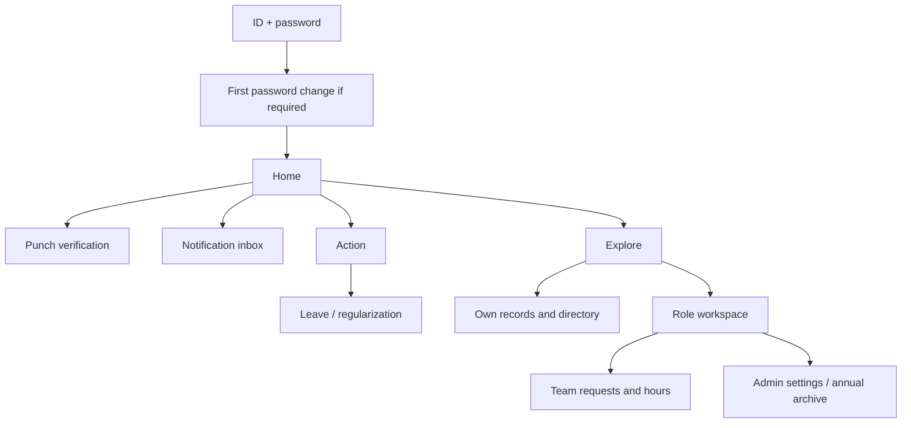

# Internal HRMS — screen and interaction design

Version 1.1 · 29 September 2026. Read [architecture.md](architecture.md) for authoritative calculations, permissions and state machines, [test.md](test.md) for acceptance, [agent.md](agent.md) for implementation order. Mobile Flutter for Android/iOS only.

## 1. Reference inventory and interpretation

The following are original supplied JPEGs, renamed for clarity without changing image bytes. Do not copy their employee names, payroll values, faces, logos or unrelated company identity into the app. The narrow, long screenshots are scroll captures, not target viewport proportions.

| Local reference | Original file ending | What to reuse |
| --- | --- | --- |
| [01 Home](docs/ui-reference/01-home.jpeg) | `21.06.40.jpeg` | Greeting, shift/punch card, exception strip, team status, masked payslip, holiday cards |
| [02 Actions](docs/ui-reference/02-actions.jpeg) | `21.06.39 (2).jpeg` | Stacked white action rows, soft category-icon squares, bottom navigation |
| [03 Explore overview](docs/ui-reference/03-explore-overview.jpeg) | `21.06.39.jpeg` | Rounded full-width pastel module cards, hierarchy and illustrations |
| [04 Leave expanded](docs/ui-reference/04-explore-leave.jpeg) | `21.06.40 (1).jpeg` | Expanded cyan card and pill actions |
| [05 Salary expanded](docs/ui-reference/05-explore-salary.jpeg) | `21.06.38 (2).jpeg` | Peach salary card and orange action pills |
| [06 People expanded](docs/ui-reference/06-explore-people.jpeg) | `21.06.38 (1).jpeg` | Pink People card, profile/directory actions |
| [07 To Do and documents](docs/ui-reference/07-explore-todo-documents.jpeg) | `21.06.38.jpeg` | Teal review card and document module |
| [08 Engage reference](docs/ui-reference/08-engage-reference.jpeg) | `21.06.39 (1).jpeg` | Deferred social feed visual reference only |

Reference feature names are not blanket scope approval. Do not implement Worklife, Helpdesk, social comments/reactions, tax statements/declarations, YTD salary calculations or bank integrations. Salary is uploaded PDF payslips. Keep Engage reference for future extension.

## 2. Visual system

Match the supplied arrangement and gentle colors with accessible contrast. Tokens below are proposed approximations, not claimed pixel samples. Inspect references while implementing.

| Token | Value / role |
| --- | --- |
| Background | `#F6F7F9` |
| Surface | `#FFFFFF` |
| Main text / secondary | `#263342` / `#596678` |
| Primary/nav selected | `#4B59C7` |
| Attendance card / action | `#DFE3FF` / `#4B59C7` |
| Leave card / action | `#E3F9FB` / `#007C89` |
| Salary card / action | `#FFF0DD` / `#A94B00` |
| People card / action | `#FFE5EF` / `#AE275B` |
| Approvals card / action | `#D8F6F0` / `#007768` |
| Optional Worklife card | `#D8F1D5` (not shown in initial scope) |
| Error / warning / success | `#B42318` / `#8A5700` / `#287A35` plus icon/text |
| Border | `#E3E7ED` |

Use system-compatible readable typography; 16 sp body, 14 sp supporting labels, 20–24 sp screen titles, 26–28 sp module title at base scale. Respect system text scaling up to 200%; no fixed-height clipping. Space in 4/8/12/16/24/32 dp increments. Phone horizontal padding 16 dp; card padding 20 dp, radius 20 dp; action row radius 16 dp, icon tile 52 dp, tap target >=48 dp. Soft borders/shadows; no heavy gradients, glass effects or excessive animations.

Module art: small original/licensed SVG or raster illustration; decorative, excluded from screen-reader reading. Reuse style of hand-drawn friendly illustrations without cropping supplied screenshots into production widgets. Do not depend on remote image calls for core UI. Fallback icon if assets unavailable. Punch button is prominent, wide and labeled with action. Red/green state is also explained in text.

Motion 150–220 ms accordion/button transitions with reduced-motion support. Flutter native date pickers/keyboard conventions, SafeArea, dark-status-text on light surfaces. Initial theme is light; dark mode deferred until all tokens are specified/tested.

## 3. Navigation and role adaptation

Initial bottom navigation: **Home · Action · Explore**. The reference's fourth tab, Engage, is deferred and hidden, never a dead tab. If announcements/feed is later approved, add Engage with the supplied reference. Notification inbox is a Home app-bar icon.

One app, one identity; no insecure role-switch dropdown. Own employee features always available to Manager/HR/Admin. Authorized workspaces are cards under Explore and shortcuts on Home. HR/Admin screens must be complete on a small phone; no required desktop flow.

go_router route guard is UX only; backend authorizes every query/action. Deep links carry non-sensitive IDs, reload current permissions and request state, then route. Back navigation preserves filters and asks about unsaved form changes. Returning from background refreshes auth/state and sensitive previews. While protected team/reviewer/payroll screens are visible, refresh authorization within 30 seconds. Offline hides those details; own minimal cached history may remain clearly stale. Previously displayed or explicitly saved content cannot be recalled remotely.

## 4. Screen catalogue and acceptance

All screens have skeleton/loading, accessible empty state, retryable error, offline/stale label, unauthorized state and safe back navigation. Never conflate 'no rows' with network failure. Each screen ID maps to tests.

| ID / route | Role | Content and primary actions |
| --- | --- | --- |
| S01 `/login` | Signed out | Employee ID, password, show/hide password, Sign in, 'Contact HR to reset password'; generic errors; no signup/OTP |
| S02 `/password-change` | Restricted user | Temporary/current credential verification, new/confirm password, criteria, submit; business navigation unavailable |
| S03 `/home` | All | Greeting/avatar/date, current shift/lunch, state card, IN/OUT, last punch, correction banner, own latest payslip availability, upcoming holidays; team summary only with permission |
| S04 `/punch` | All active | Location permission/precise instructions, accuracy, office distance, sample age, provisional status, verify button, server result; no map or background tracking |
| S05 `/action` | All | White action rows: regularize, attendance info, apply leave, balance, holiday calendar, payslips; 'Review requests' appears for eligible reviewers |
| S06 `/explore` | All | Attendance, Leave, Salary, People, To Do when relevant, Documents; role workspace accordion; one expanded module at a time |
| S07 `/attendance` | All | Own calendar/list toggle, month/date range, status chips, total expected/worked/short hours, lazy history, detail link |
| S08 `/attendance/:id` | Own/scoped | Shift and policy version, original punches, approved adjustments, paid lunch label, required interval after leave, intervals/totals, verification result, history, Request correction |
| S09 `/corrections/new` | All | Target workday/shift, proposed IN/OUT, reason, optional allowed attachment; validate overnight end; preview before submit |
| S10 `/requests/:id` | Owner | Status, dates/intervals, current version, Edited badge, first-review indicator, own history, edit/withdraw/cancel options by state |
| S11 `/leave` | All | Balance cards per type, allocated/used/reserved/available, annual selector, history/status, Apply leave |
| S12 `/leave/apply` | All | Type, start/end date, full/AM/PM options with actual slot times, reason, computed working-day units, balance impact, work/leave conflict errors, optional evidence, submit preview |
| S13 `/holidays` | All | Calendar/list, office/year selector within scope, weekly-off legends, upcoming list; Admin add/edit/publish action |
| S14 `/payslips` | All | Last 12 salary-month slots, available/missing/archived badge; no other employee picker for Member |
| S15 `/payslips/:id` | Owner/payroll | Employee and month header, secure PDF preview, download/save, revision badge; unavailable archive message; no unverified net-pay extraction |
| S16 `/profile` | All | Name/code, photo, read-only role badges, designation, department, team, reporting manager, office/shift, employment dates; private edit section |
| S17 `/people` | All | Name/code search, safe team/department filters, directory; private employee fields never sent to this view |
| S18 `/documents` | All/scoped | Company policies and own documents separated; class/date/version, view/download, private status |
| S19 `/notifications` | All | Read/unread list, minimal labels, safe deep link, mark read; no medical/salary values in preview |
| S20 `/settings` | All | Change password, notification choices, authorized device info, logout; app version |
| S21 `/workspace` | Manager/HR/Admin | Role-scoped team status, pending approvals, missed punches, short-hour summary; Admin storage/export reminder |
| S22 `/approvals` | Assigned reviewers | Leave/correction queue tabs, employee/date/status filters, pagination; viewing list does not lock requests |
| S23 `/approvals/:id` | Assigned/fallback | Server acquires review lock before detail; employee proposal, balance/schedule impact, revision history; approve/reject/return, mandatory reasons as applicable |
| S24 `/reports/hours` | Scoped reviewer | Day/week/month/custom picker, team/employee/office filters; mobile summary cards, expandable rows, exact hour/minute detail; Admin XLSX export |
| S25 `/employees` | HR/Admin | Employee search/status/team filter, active cap indicator, add employee, details; inactive included when selected |
| S26 `/employees/:id` | HR/Admin | Full authorized HR fields, assignment history, personal details, documents, attendance; payroll section only with grant; changes audited |
| S27 `/employees/new` | HR/Admin | Required employment fields, role options limited to issuer, office/team/shift, generated code, create; one-time temporary password panel |
| S28 `/payroll/uploads` | Payroll HR/Admin | Employee/month selector, PDF picker <=5 MB, validation/quarantine state, preview, publish/replace with reason; upload history |
| S29 `/admin/teams` | Admin; delegated HR | Departments, teams, manager assignments, effective date, validation; no cycles |
| S30 `/admin/shifts` | Admin; HR draft | Start/end/overnight, weekdays, grace, paid lunch interval, early-entry window, checkout extension, audited work-schedule exceptions; worked-hours examples and version effective date |
| S31 `/admin/offices` | Admin | Coordinates, office/timezone, radius/accuracy/freshness, active switch; on-site calibration instructions and test status |
| S32 `/admin/leave-policies` | Admin | Leave types/paid units/carryover/half-day/backdating, leave year, holiday target, approval Manager-or-HR per team/type, non-self fallback |
| S33 `/admin/permissions` | Admin | Role grants, payroll delegation, approver fallback, deactivate/reset restrictions; protect last Admin; recent reauth |
| S34 `/admin/archive` | Admin | Annual period, closed-year selector, due task, export state/progress, local-save acknowledgment, cleanup eligibility and storage usage |
| S35 `/admin/archive/:id` | Admin | Cutoff/as-of, counts/bytes/revision, resumable downloads, failures, verify/save, cleanup preview, confirmation, result/audit |
| S36 `/admin/audit` | Admin; HR scoped | Date/actor/action/entity filters, before/after redacted changes, decision/request IDs; cursor pagination |
| S37 `/admin/organization` | Admin | Timezone, annual-period selector/transition preview, storage alert budget, maintenance health, policy activation, app/help contact; never show secret keys |
| S38 `/announcements/new` | HR/Admin | Optional simple title/body + target team, preview recipient scope, publish as in-app notification; no feed/comments |

## 5. Critical interaction details

### Home / punch

Use reference 01 layout with a compact shift card instead of a huge clock graphic. Show '10:00 AM–7:00 PM · 9 h · lunch included'. Member sees own status; 'Who is in' team donut only with attendance permission. Directory access does not authorize coworkers' attendance or live locations.

Punch states: permission needed -> acquiring -> ready/provisional -> verifying -> committed success or actionable failure. Disabled button gives reason. Server rejection updates client state. While verifying disable double-tap; app termination/reopen reconciles operation key. Never show a verified green check for local/offline success. Poor indoor location explains moving to better reception or requesting correction, without exposing fraud internals.

### Request form and review lock

Before first review, Edit appears with 'Editable until your approver opens this request.' Once edited show 'Edited · version 2' and time, not everyone-visible original private content. After review: 'In review — contact your approver for changes.' Returned request exposes edit action and reviewer reason; balance cards explain that its reservation was released and resubmission must check availability again. WithdrawalPending displays a waiting state with accept/decline actions only for the eligible reviewer; declined approved-leave cancellation restores the Approved display. An edit rejected because reviewer opened simultaneously preserves unsaved text in memory and explains lock; do not auto-submit it.

Reviewer details call the locking RPC; merely scrolling the queue does not lock. Detailed reason/history/attachments are absent from the queue payload, not merely hidden in the widget. A reviewer cannot preview an attachment without establishing the current review lock. Decision displays employee, exact dates/units/intervals, impact and assigned scope. No self-approve button; backend denies direct invocation. Missing fallback is a setup issue with a link visible only to Admin.

### Hours report

Top: date-range control, Day/Week/Month/Custom, employee/team filters. Summary: expected, worked, short and extra hours. Rows show name, date, IN–OUT, paid-lunch tag and exception badges. On narrow phones use expandable stacked rows; avoid horizontally scrolling 12 columns. Detail shows seconds only when investigating; normal display H h M min. Open sessions read 'In progress', missing checkout 'Needs correction'. Extra time is not labelled overtime pay. On half-day leave, show the actual required interval (e.g. 14:30–19:00 after AM leave) and use it for late/early labels. Show unresolved-day count beside totals and label known totals as partial when punches are missing. A stale previous-day session has a correction banner but does not block today's new IN.

### Payslip and profile

Home payslip card is masked by default if salary amount exists, resets masked on background/logout, and may simply show available month/PDF link. Hiding a number is not access control. Full PDF only fetched through the audited authorization endpoint and its server-limited signed link; the client cannot fetch/sign protected Storage objects directly. Never infer gross/net/deduction fields from screenshots. Member's private information not displayed in People directory.

Upload workflow: select employee -> salary month -> file -> verify actual type/size -> preview -> publish. Mismatched employee/month needs correction before publish. Duplicate month offers new revision with reason. Sending a draft file upload never notifies Member until publication succeeds. 'Missing' means no published file; 'Archived locally' means removed cloud file with retained archive metadata.

### Annual archive and cleanup

Settings includes annual period (Jan–Dec or Apr–Mar). Annual archive locked before end with date; ordinary XLSX reports still exportable. On year rollover Home Admin card says 'Annual archive due'. If a last-day overnight shift remains punchable, archive preview says provisional and lists the earliest cleanup eligibility time; staff can finish that shift normally. No staff features locked by overdue reminder.

Show: business period, included-through date, generated/as-of time, revision, selected employees/files, expected disk space. Status: preparing -> downloading n/N -> verifying -> ready to save -> local save acknowledged -> cleanup eligible. Error or cancel has Resume, no false completion. If earlier cloud files were deleted, offer Select previous local archive, validate/merge originals, then build the complete new revision. If unavailable, show missing files and offer a clearly marked partial report only; no complete-archive acknowledgment or further cleanup.

Cleanup requires recent password reauthentication plus typed period label. Preview eligible paths/counts/size and explicit exclusions. If recent salary-month files will be removed: 'These payslips will remain listed as archived and cannot be downloaded from the app.' Acknowledge saving the local archive and review local-copy responsibility. Admin explicitly deletes; no automatic post-export delete. Partial failure shows individual retry counts and retained manifest; do not show an Undo button when bytes are gone. Another reauthenticated Admin can Resume. Abandon shows already deleted/remaining counts, explains that it releases the period for edits without restoring files, and requires a later full re-export before new cleanup.

Use nested folders from architecture in downloaded ZIP. Archive may be large: show disk/network progress; allow app suspension/resume; do not freeze UI for ZIP/XLSX generation. Plain exported files are sensitive local copies; app does not claim protection after user saves to external Files/share location.

## 6. Layout, accessibility and validation

- Target 360–430 dp phone width and tablet portrait using same mobile app; landscape keyboard usable. Preview screenshots at 360x800 and 390x844 logical sizes. Never use long-capture image dimensions as app canvas.
- TalkBack/VoiceOver labels for punch, accordion expanded state, status and dates; focus moves to validation summary, not random top of screen. Date dialogs announce chosen range. Donut also has textual counts.
- Contrast >=4.5:1 normal text, >=3:1 large text/non-text controls; validate actual tokens with chosen weights. Avoid screenshot's faint inactive-nav contrast. No information solely by hue.
- Required fields show inline errors after submit/blur; preserve entered values on retry. Mask password only, allow paste. Keyboard types match fields. Never trim intentional spaces in password.
- Long names, joined scripts/Indian names, emoji, absent photo, and safe truncation all supported. Employee code always accessible. PDF preview has native fallback download when renderer cannot display a valid document.
- All destructive actions show concrete target and irreversible consequence; routine reads/edits require no unnecessary confirmation. Confirmation screens do not replace backend checks.
- Sort/filter state appears in export preview so report and archive scope cannot be confused. Date/time formats readable local, API canonical UTC/ISO.

## 7. Design completion checklist

- [ ] Inspect all eight originals; implement Home, Actions, Explore styles using actual Flutter widgets.
- [ ] Implement S01–S37 with real role-specific data; S38 only if simple announcement permission is enabled.
- [ ] Verify every form/state/permission in the catalogue; no dead reference-only items.
- [ ] Record Android/iOS screenshots of primary, empty, error, large-text and unauthorized states.
- [ ] Validate S04 punch, S23 approvals and S35 archive on real devices and interrupted network.
- [ ] Align UI messages/error codes with architecture; attach test evidence in continue.md.

## 8. Review corrections in v1.1

The visual references are unchanged. Corrections affect behavior and explanation: half-day required intervals, stale-session recovery, returned-request balances, true review locks on detail/attachment access, audited protected downloads, provisional overnight year-end archives, local-base re-export and partial-cleanup recovery. See continue.md for the review findings and test.md for regression cases.
